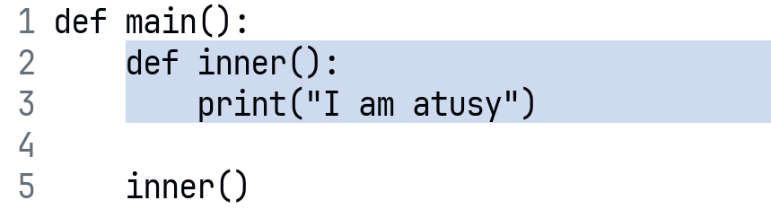

<style>
video,img {
  max-width: 100%;
  max-height: 100%;
  object-fit: contain;
  border: 1px solid #888;
}
a {
  color: #5555AD;
}
small {
  font-size: 0.8em;
}
strong {
  color: #AD5555;
}
h1 {
  font-size: 1.3em;
}
</style>

# Beyond Syntax Highlighting in Neovim: <br> Unlocking the Power of Tree-sitter

 atusy

---

##  atusy

- Engineering Manager and Developer
- Big fan of Neovim writing plugins and blogs
- Follow me at
    - <https://github.com/atusy>
    - <https://x.com/Atsushi776>
    - <https://blog.atusy.net>

---

## Special Thanks

- **[3-shake Inc.](https://3-shake.com/)**
    - The Bronze sponsor of VimConf 2025 small
    - My former employer
- **[Atmark Inc.](https://attm.co.jp/)**
    - My current employer

---

## Questions

- Do you know tree-sitter?
- Do you use tree-sitter?
- Do you use tree-sitter in Vim?

---

## What is tree-sitter in general

- **Parsing library** (enough for today)
- More specifically, a parser generator tool & an incremental parsing library
    - supports on diverse programming languages
    - fast enough to react text changes
    - robust user experience under syntax errors

---

## What is tree-sitter in Neovim/Vim?

- In Neovim
    - Builtin feature to support syntax-aware featues, e.g. syntax highlighting
- In Vim
    - Opt-in feature to enable syntax highlighting ([mattn/vim-treesitter](https://github.com/mattn/vim-treesitter))

---

## Is tree-sitter for syntax highlighting?

- No, tree-sitter is just a parsing library
- Applicable to variety of syntax-aware features
    - Highlighting
    - Code folding
    - Smart selection (e.g., function definition)
    - Outline

---

## What can be done by parsing?

- Identify node type of a region
    - function definition, string literal, assignment expression, ...
- Identify hierarchical structure of nodes
- Allow querying nodes by type and structure

---

## Today's goal

Be aware of tree-sitter as a tool to build your own workflow by

- Exploring usecases beyond syntax highlighting
- Showing insightful tree-sitter integration patterns
- Developing treesitter-ls, a language server

---

## What I don't cover today

- Details of configurations and plugin development
- Deep dive into tree-sitter internals

---

## Usecases by Neovim-builtin features

Let's learn

- Usage
- Implementation pattern
- Insight

from variety of features

---

### How many are the builtin?

<style scoped>
ol, p { font-size: 1.9rem }
</style>

 1. Syntax highlighting
 2. Code folding
 3. Outline
 4. Pairing keywords (like matchpair)
 5. Toggling comments
 6. Popup menu (e.g., Open URL)
 7. Open help in browser
 8. Indent
 9. Range selection/textobject
10. Sticky scroll

---

### The answer is ... 7/10

- There are more builtin features
- The power of tree-sitter is already unlocked in Neovim!!
- If you use Vim, sorry for inconvenience..., but I have a good news today

---

### Syntax Highlighting

- Usage
    - `vim.treesitter.start()` to start syntax highlighting


---

### Syntax Highlighting

- Implementation pattern
    - **Parser** determines code structure
        - e.g., `"foo"` is `string` node
    - **Query** captures what to highlight
        - e.g., `(string) @string`
    - **Captures** are equal to highlight groups
        - e.g., `:hi @string guifg=Black`

---

### Syntax Highlighting

- Demo with `examples/url.py` and `runtime/queries/python/highlights.scm`
    1. Highlight nothing
    1. Highlight `comment` and `string`
    1. Highlight all `string_content` in `string`
    1. Highlight only URL-like `string_content`

---

### Syntax Highlighting

- Example 1
    - Query `string` nodes

```query
; node    ->  capture (highlight group)
(string)      @string
```

---

### Syntax Highlighting

- Example 2
    - Query URL-like `string_content`
        - by testing nest pattern and regex

``` query
(
  string (string_content) @string.special.url
  (#match? @string.special.url "^https?://\\S+$")
)
```

<!--
Demo scenario

- Open examples/url.py
    - Start with blank query
    - Add `((string) @string)`
    - Add `((string) (string_content) @string.special.url)`
    - Update the above to `((string) (string_content) @string.special.url) (#match? @string.special.url "^https?://\\S+$")`
-->

---

### Syntax Highlighting

- Insight
    - Query can capture complex pattern of nodes
        - e.g., nest pattern and regex pattern
    - Query is customizable
    - Users can define what to highlight per filetype without parser modification

---

### Code folding with foldexpr

- Usage
    - Enables structure-aware code folding based on syntax tree

```vim
:set foldmethod=expr
:set foldexpr=v:lua.vim.treesitter.foldexpr()
```

---

### Code folding with foldexpr

- Implementation pattern
    - Query determins what to fold
        - e.g., `(function_definition) @fold`
    - Neovim determines how to fold
        - by calculating fold levels of the captures

---

### Code folding with foldexpr

- Insight
    - Users can customize foldable nodes per filetype without parser modification

---

<!-- ### Language Injections -->


---

### Language Injections

- Usage
    - Apply tree-sitter features to embedded languages by recursive parsing
        - e.g., highlight code blocks

---

### Language Injections

- Implementation pattern
    - Query determines what to inject
        - embedded source codes as `@injection.content`
        - corresponding languages as `@injection.language`

---

### Language Injections

- Example 1
    - Parse markdown code blocks

```query
(fenced_code_block
  (info_string
    (language) @injection.language)
  (code_fence_content) @injection.content)
```

---

### Language Injections

- Example 2 <!-- optional -->
    - Parse URL-like strings as URIs

```query
(
  (string_content) @injection.content
  (
      #match? @injection.content 
      "^[a-zA-Z][a-zA-Z0-9]*://\\S+$"
  )
  (#set! injection.language "uri")
)
```

---

### Language Injections

- Insight
    - Opens door to apply language-specific features (highlighting, folding, etc.) to embedded content

---

### Context-aware popup menu

- Usage
    - Right-click popup menu shows context-specific actions


---

### Context-aware popup menu

<!-- [Source in Neovim](https://github.com/neovim/neovim/blob/a04c73ca071fdc2461365a8a10a314bd0d1d806d/runtime/lua/vim/_defaults.lua?plain=1#L487-L489) -->

- Example
    - "Open in web browser" for URL-related nodes

---

### Context-aware popup menu

- Implementation pattern
    - Query assigns `url` metadata to nodes
    - Lua code tests if the node has `url` metadata

```query
(
  (inline_link
      (link_destination) @_url
  ) @_label
  (#set! @_label url @_url)
)
```

<!-- [Source in Neovim](https://github.com/neovim/neovim/blob/a04c73ca071fdc2461365a8a10a314bd0d1d806d/runtime/queries/markdown_inline/highlights.scm?plain=1#L94-L96) -->


---

### Context-aware popup menu

- Insight
    - Set **metadata** to detemine complex pattern of what to process

---

## Quick summary 1

- **Query-based approach** is a common pattern
    - Queries define **what** to process in language-specific way
    - Neovim APIs define **how** to process (often) in language-agnostic way
- **Customize queries** to meet your needs

---

## Tips to get started with queries

- See `:h lua-treesitter-query` for how to interact with queries in Lua
- View parse results with `:InspectTree`
- Test query with `:EditQuery`
- Examples queries at <small> <https://github.com/nvim-treesitter/nvim-treesitter/tree/main> </small>


---

## Usecases by plugins

Some of my favorites...

---

### Navigate open/mid/close keywords

[andymass/vim-matchup](https://github.com/andymass/vim-matchup)

<video src="images/example-matchup.mp4" controls></video>

---

### Navigate and highlight matching keywords


- Usage
    - Navigate and highlight matching keywords
        - keywords: `if`/`else`/`end`, ...
        - quotes: `""`, `''`, ``` `` ```, ...
        - braces: `()`, `[]`, `{}`, ...

---

### Navigate and highlight matching keywords

- Implementation pattern
    - Query captures open/mid/close nodes
    - Uses special query files, `matchup.scm`
        - This avoids conflicts with other queries such as `highlights.scm` and `folds.scm`

---

### Navigate and highlight matching keywords

- Example query for Lua loops

<small> [https://github.com/andymass/vim-matchup/blob/ca538c3b/after/queries/lua/**matchup.scm**?plain=1#L3-L5](https://github.com/andymass/vim-matchup/blob/ca538c3bb02836510526ff7d07cf7e4c8e9a3b90/after/queries/lua/matchup.scm?plain=1#L3-L5) </small>

```query
(
  for_statement
  "do" @open.loop
  "end" @close.loop
) @scope.loop
```


---

### Navigate and highlight matching keywords

- Insight
    - **Query defines what** to match in language-specific way, and let **Lua code handle how** in language-agnostic way
    - **Plugin-specific query files** is a good pattern to avoid conflicts among multiple plugins

---

### Show context at the ends of functions, methods, statements, ...

[haringsrob/nvim_context_vt](https://github.com/haringsrob/nvim_context_vt)


---

### Show context at the ends of functions, methods, statements, ...


- Usage
    - Shows virtual text of the current context after functions, methods, statements, etc.

---

### Show context at the ends of functions, methods, statements, ...

- Implementation pattern
    - [Hard code node types](https://github.com/andersevenrud/nvim_context_vt/blob/fadbd9e57af72f6df3dd33df32ee733aa01cdbc0/lua/nvim_context_vt/config.lua#L18-L180) in Lua, no queries
        - Heavy dependence on parsers
        - Common node types allow partially language-agnostic implementation (e.g., function_definition)

---

### Show context at the ends of functions, methods, statements, ...

- Insight
    - Parser-based approach can be less language-specific because parsers tend to share common node types

---

### Sticky scroll

[nvim-treesitter/nvim-treesitter-context](https://github.com/nvim-treesitter/nvim-treesitter-context)


---

### Sticky scroll

- Usage
    - Show parent contexts at the top of the window
        - Markdown headings
        - Function/method/class definitions

---

### Sticky scroll

- Implementation pattern
    - Use queries to capture context nodes (`@context`)
    - Show first line of `@context` capture as is
        - No need to know nest levels

---

### Sticky scroll

- Insight
    - Yet another example of query-based approach

---

### Quickly select syntactic regions

[atusy/treemonkey.nvim](https://github.com/atusy/treemonkey.nvim)

<video src="images/example-treemonkey.mp4" controls></video>


---

### Quickly select syntactic regions

- Usage
    - Quickly select syntactic regions by label hints

---

### Quickly select syntactic regions

- Implementation pattern
    - Get node ranges of anscestor nodes by traversing syntax tree from the cursor position
    - Use two-step selection to avoid ambiguity of overlapping label hints

---

### Quickly select syntactic regions

- Insight
    - The tree structure is only the interest
        - No interests in node types or query-captured names
        - Parser-agnostic and query-free

---

### Extra highlight for special nodes

[atusy/tsnode-marker.nvim](https://github.com/atusy/tsnode-marker.nvim)


---

### Extra highlight for special nodes


- Usage
    - Highlight nodes that satisfy conditions
    - Supports highlighting to the end of the line

---

### Extra highlight for special nodes

- Examples
    - Highlight markdown fenced code blocks
    - Highlight nested function definitions



<!-- show demo what happens if highlight is done only by builtin feature -->

---

### Extra highlight for special nodes

- Implementation pattern
    - Find a node that satisfies one of
        - `@tsnodemarker` highlight capture
        -  User-defined callback functions
    - Applies additional highlights via extmarks

---

### Extra highlight for special nodes

- Insight
    - Callback based approach allows flexible customization beyond query capabilities

---

### And more...

1. Auto-close keywords
    - [RRethy/nvim-treesitter-endwise](https://github.com/RRethy/nvim-treesitter-endwise)
    - Example: Typing `if ... then` in Lua automatically adds `end`
2. Outlines
    - [stevearc/aerial.nvim](https://github.com/stevearc/aerial.nvim)

---


### And more...

3. Textobjects
    - [nvim-treesitter/nvim-treesitter-textobjects](https://github.com/nvim-treesitter/nvim-treesitter-textobjects)
4. Commenting
    - [numToStr/Comment.nvim](https://github.com/numToStr/Comment.nvim) + [JoosepAlviste/nvim-ts-context-commentstring](https://github.com/JoosepAlviste/nvim-ts-context-commentstring)

---

## Quick summary 2

- Vast variety of plugins uses tree-sitter
- Tree-sitter integration has **diverse approaches**
    - query
    - parser
    - callback
    - tree-traversal

---

### Quick summary of approaches

1. **Query**-based
    - Highly declarative
    - Requires query per lanuguage
2. **Parser**-based
    - Requires Lua code identify what to process
    - Partially language-agnostic logic with the help of common node types

---

### Quick summary of approaches

3. **Callback**-based
    - Requires user-defined Lua functions
    - Allows maximum flexibility
4. **Tree-traversal**-based
    - Applies iff only tree structure matters

---

## Yet another approach to bring tree-sitter power to editors

🚧 **Treesitter-ls** 🚧

A WIP language server powered by tree-sitter

<https://github.com/atusy/treesitter-ls>

---

### Language servers provide intelligence tools

- Go to Definition
- Find References
- Folding Range
- Selection Range
- Rename
- Semantic Tokens


---

### Typical language servers are language-specific

such as ...

- pyright (Python)
- tsserver (TypeScript/JavaScript)
- rust-analyzer (Rust)


---

### Are language servers language-specific?

- No, not necessarily
- [copilot-language-server](https://www.npmjs.com/package/@github/copilot-language-server) provides AI-powered code completions for any language
- [treesitter-ls](https://github.com/atusy/treesitter-ls) can support any language given a tree-sitter parser and queries

---

### Can treesitter-ls provide intelligence tools?

Yes, for example:

- Semantic Tokens (higihlighting)
- Go to Definition
- Find References
- Folding Range
- Selection Range
- Rename


---

### Will treesitter-ls replace language-specific servers?

No, because ...

- Some require deeper semantic understanding
    - e.g., type checking, linting, code actions, ...
- [treesitter-ls](https://github.com/atusy/treesitter-ls) capable features can be better provided by language-specific servers
    - e.g., scope-aware go to definition

---

### Why treesitter-ls?

To unlock various possibilities:

1. Unlock **availability** to any LSP-capable editor
    - Allows Bram's Vim users to enjoy tree-sitter features
    - Editors may even omit builtin syntax highlighting, which tend to be essential

---

### Why treesitter-ls?

2. Unlock **gaps** in language-specific servers
    - Provide consistent Folding, SelectionRange, and SemanticTokens where absent in language-specific servers
    - People may **forget about which server supports which feature**

---

### Why treesitter-ls?

3. Unlock **difficulty** to support niche or emerging languages
    - Just ship a tree-sitter parser + queries instead of a full server
    - Developer productivity **boost for new languages**


---

### Why treesitter-ls?

4. Unlock **injected-language workflows**
    - Use tree-sitter injections for code blocks, template strings, and DSLs
    - By [treesitter-ls](https://github.com/atusy/treesitter-ls) itself being LSP-client
        - Receive LSP-config from editor, and attach language servers for injected languages automatically

---

## ENJOY!!

- Syntax-aware features are powerful
    - e.g., highlighting, code folding, outline, sticky scroll, range selection, and more
- Use tree-sitter to implement syntax-aware features
- Star [atusy/treesitter-ls](https://github.com/atusy/treesitter-ls) that brings tree-sitter power to any LSP-capable editor

<style>
section {
    justify-content: flex-start;
    align-content: start;
font-size: 3rem;
}
</style>
